# `Django`를 공부하자
현재 `Instagram`, `Pinterest`등 `django`가 기반인 프로젝트가 많습니다  
이 튜토리얼은 초심자가 사진을 업로드 할 수 있는 블로그를 제작하기 위해  
기본적인 개념만 짚기에 깊이가 얕습니다.  
깊이 있는 공부가 하고 싶다면? [장고 튜토리얼 공식문서로 바로가기](https://docs.djangoproject.com/en/2.1/intro/tutorial01/)  

#### 순서 

- [`Django` 환경세팅](#django-환경세팅) 
- [첫 페이지](#첫-페이지-만들자)
- `Django`의 구조
    - [`Django`는 `MTV`](#mtv)
    - [`CRUD`](#crud)
- 목록 페이지
    - [목록 페이지 만들자](#목록-페이지-만들자)
    - [목록 페이지에 게시글 띄우기](#목록-페이지에-게시글-띄우기)
- [게시글 `Model`](#model-만들기)
- [`Superuser`](#superuser-만들기)
- [게시글 세부페이지](#게시글-세부페이지)
- [이미지 업로드](#이미지-업로드)

## `Django` 환경세팅

개인 컴퓨터에 설치하거나 [구름 IDE](https://ide.goorm.io)에서 사용하여도 됩니다  
[구름 IDE에 프로젝트 생성하기](https://github.com/haedal-programming/goormTutorials)

`mysite` 폴더 만들자
```console
root@goorm:/workspace/django# mkdir mysite
```

`mysite` 폴더로 들어가자
```console
root@goorm:/workspace/django# cd mysite
```

`pip3`를 이용해 `virtualenv`를 다운로드하자  
가상환경을 설정합니다. 프로젝트 관리를 편하게 해줍니다  
자세한 내용은 검색을 해보자 이 문서는 튜토리얼이니 실습에 맞춰져 있습니다

```console
root@goorm:/workspace/django/mysite# pip3 install virtualenv
```

가상환경 설정을 위해 `virtualenv`를 `mysite/myvenv` 폴더에 설치합니다  
`/bin`, `/include`, `/lib` 폴더가 설치됩니다
```console
root@goorm:/workspace/django/mysite# virtualenv myvenv
```

설정한 가상환경을 실행합니다  
**프로젝트를 실행할때마다 반복해서 사용하는 명령어입니다**
```console
root@goorm:/workspace/django/mysite# source myvenv/bin/activate
```
django 프로젝트를 설치합니다
```console
(myvenv)root@goorm:/workspace/django/mysite# pip3 install django==2.1
```
현재 `/django/mysite` 폴더에 `tutorialdiango` 프로젝트를 생성합니다   
`/tutorialdjango` 폴더와 `manage.py`가 생성됩니다
```console
(myvenv) root@goorm:/workspace/django/mysite# django-admin startproject tutorialdjango . 
```
`django`가 사용할 DB를 생성합니다(migrate 합니다)
```console
(myvenv) root@goorm:/workspace/django/mysite# cd tutorialdjango
(myvenv) root@goorm:/workspace/django/mysite/tutorialdjango# python manage.py migrate
```
이제 `/mysite/tutorialdjango/settings.py`로 이동하셔서 28번째 줄을 수정합니다.  
모든 사용자의 접속을 허락하는 코드로 수정합니다
```python
ALLOWED_HOSTS = ['*']
```
이제 `django` 프로젝트를 실행합니다  
로컬에서 실행하는 경우 [http://0:80/](http://0:80/)로 접속합니다  
구름 IDE를 사용하는 경우 `/프로젝트/실행 URL과 포트`에서 80번 포트를 설정 후 접속합니다
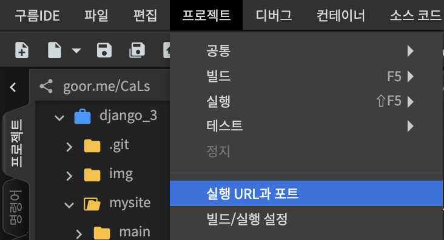
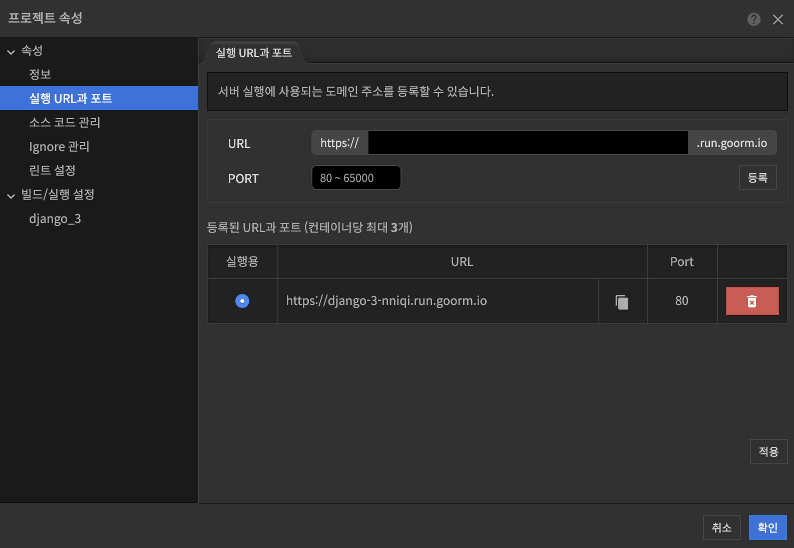

```console
(myvenv) root@goorm:/workspace/django/mysite/tutorialdjango# python manage.py runserver 0:80 
```
아래의 그림이 뜨면 `django` 설치 완료  


## 첫 페이지 만들자

`/mysite` 폴더 아래에 `/main`폴더를 만듭니다
```console
(myvenv) root@goorm:/workspace/django/mysite# python manage.py startapp main
```
`/mysite/tutorialdjango/settings.py`의 33번째 줄을 보면 `INSTALLED_APPS`가 있습니다

수정을 안한 `django` 기본 세팅값은 아래와 같습니다
##### 수정 전 `settings.py`
```python
INSTALLED_APPS = [
    'django.contrib.admin',
    'django.contrib.auth',
    'django.contrib.contenttypes',
    'django.contrib.sessions',
    'django.contrib.messages',
    'django.contrib.staticfiles',
]
```
좀 전에 수정한 `main` app을 추가합시다.   
이 작업을 하지 않으면 앱이 구동하지 않습니다.  
여러 개의 앱을 만들 경우 모두 여기 등록합니다.  

##### 수정 후 `settings.py`
```python
INSTALLED_APPS = [
    'django.contrib.admin',
    'django.contrib.auth',
    'django.contrib.contenttypes',
    'django.contrib.sessions',
    'django.contrib.messages',
    'django.contrib.staticfiles',
    'main',
]
```
이제 `/mysite/tutorialdjango/urls.py`파일을 수정합니다  
사용자가 어떤 url을 사용해 들어오는지를 확인해봅시다  
여기선 사용자가 url로 접속시 첫 화면을 설정합니다  

##### 수정 전 `urls.py`
```python
from django.contrib import admin
from django.urls import path

urlpatterns = [
    path('admin/', admin.site.urls),
]
```

##### 수정 후 `urls.py`
```python
from django.contrib import admin
from django.urls import path
from main.views import index

urlpatterns = [
    path('admin/', admin.site.urls),
    # url로 접속 후 첫 화면은 index
    path('',index),
]
```

`/mysite/main/views.py`에서 index 함수를 만듭니다.  
사용자가 `index.html'`을 볼 수 있게 연결합니다.  

##### `views.py`
```python
from django.shortcuts import render

# index.html로 연결해주는 index 함수
def index(request):
    return render(request, 'main/index.html')
```
`/mysite/main/templates/main/index.html` 경로로 `index.html`파일을 만듭니다  
아래의 마크업을 `index.html`파일에 넣습니다
```html
<html>
<head>
    <title>Django Tutorial</title>
</head>
<body>
    <h1>메인 페이지입니다</h1>
</body>
</html>
```
서버를 키고 확인합시다
```console
(myvenv) root@goorm:/workspace/django/mysite# python manage.py runserver 0:80 
```
아래의 화면이 나오면 성공!  


#### 관리자 `admin` 접속
`https://웹페이지URL/admin` url로 들어갑니다  
아래의 화면이 나오면 성공!  


#### 정적 이미지 불러오자

`/mysite/static` 폴더를 만들고, 원하는 이미지 파일을 넣습니다.  
그 후 `/static` 폴더와 `django`와 연결시킵니다.  
[Static 파일 호출하기 django 공식문서](https://docs.djangoproject.com/en/2.1/ref/templates/builtins/#static)
##### 수정 전 `settings.py`
121번째 줄
```python
STATIC_URL = '/static/'
```
##### 수정 후 `settings.py`
```python
STATIC_URL = '/static/'
STATICFILES_DIRS = (
    # django와 static 폴더 연결
    os.path.join(BASE_DIR, 'static'),
)
```

##### 수정 후 `index.html` 
```html
<html>
<head>
    <title>Django Tutorial</title>
</head>
<body>
    <h1>메인 페이지입니다</h1>
    <!-- 정적 이미지 불러오기 -->
    
    
</body>
</html>
```
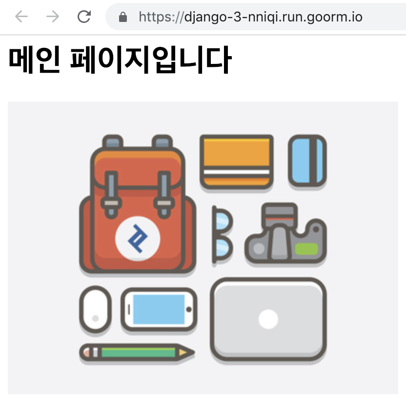

#### Time Zone 변경
한국 시간대로 맞춰줍니다
##### 수정 후 `settings.py`
109번째 줄
```python
TIME_ZONE = 'Asia/Seoul'
```
### `Django`의 구조
`Django`는 `MVC`모델을 `MTV`라고 부릅니다  

#### `MTV`
장고의 `MTV`패턴은 자바 웹 프로그래밍의 `MVC`패턴과 거의 동일한 개념으로, 웹 프로그래밍 영역을 3가지 개념으로 나눠서 개발하는 방식입니다.   


`MTV`는 3가지 영역으로 구분해 개발을 정의합니다

* DB 테이블을 정의하는 `Model`
* 사용자가 보는 화면을 정의하는 `Template`
* 에플리케이션의 제어 흐름 및 처리 로직을 정의하는 `View`  

이렇게 3가지로 나눠 개발하면 `Model`,`Template`,`View` 모듈 간에 독립성을 유지할 수 있고  
디자이너, 개발자, DB 설계자 간에 협업도 쉬워집니다

#### `CRUD`
`CRUD`는 대부분의 컴퓨터 소프트웨거 가지는 기본적인 데이터 처리 기능인  
Create(생성), Read(읽기), Update(갱신), Delete(삭제)를 묶어서 일컫는 말입니다.  


|  이름  | 조작 |   SQL  |
|:------:|:----:|:------:|
| Create | 생성 | INSERT |
|  Read  | 읽기 | SELECT |
| Update | 갱신 | UPDATE |
| Delete | 삭제 | DELETE |


## 목록 페이지 만들자

##### 수정 후 `urls.py`
```python
from django.contrib import admin
from django.urls import path
# index, blog 페이지 추가
from main.views import index, blog

urlpatterns = [
    path('admin/', admin.site.urls),
    # url로 접속 후 첫 화면은 index.html
    path('', index),
    # localhost:80/blog 접속하면 blog 페이지
    path('blog/', blog),
]
```

##### 수정 후 `views.py`
```python
from django.shortcuts import render

# Create your views here.
def index(request):
    return render(request, 'main/index.html')

def blog(request):
    return render(request, 'main/blog.html')
```

###### `mysite/main/template/main/blog.html` 작성
```html
<html>
<head>
    <title>Django Tutorial!</title>
</head>
<body>
    <h1>Blog Page!</h1>
</body>
</html>
```
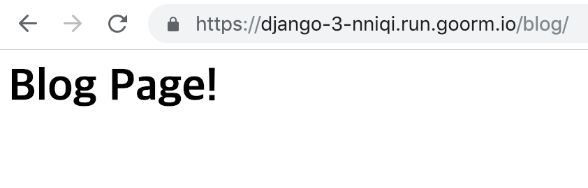  
위의 페이지가 뜨면 성공!  


서버를 어떻게 실행했는지 기억나시나요?
### `웹서버 실행` 복습  

**프로젝트를 실행할때마다 반복해서 사용하는 명령어입니다**  
파이썬 가상환경 설정 
```console
root@goorm:/workspace/django/mysite# source myvenv/bin/activate
```
이제 `django` 웹서버를 실행합시다  
로컬에서 실행하는 경우 [http://0:80/](http://0:80/)로 접속합니다  
구름 IDE를 사용하는 경우 `/프로젝트/실행 URL과 포트`에서 80번 포트를 설정 후 접속합니다
```console
(myvenv) root@goorm:/workspace/django/mysite# python manage.py runserver 0:80 
```

## `Model` 만들기

블로그에서 각각의 포스팅에 저장될 공간을 만듭니다.  
`Post` 게시글 마다 `postname`(제목), `contents`(내용)이 존재합니다.  
이를 구현한 아래의 파이썬 코드

##### `mysite/main/models.py`
```python
from django.db import models

class Post(models.Model):
    postname = models.CharField(max_length=50)
    contents = models.TextField()
```

이제 모델을 만들었고 `django`의 db에 `migrate`해줍니다  
게시글마다 제목과 내용을 저장할 수 있게 됩니다  

##### `Ctrl + C`를 눌러 `웹서버`를 종료 후 `migration`

```console
(myvenv) root@goorm:/workspace/django/mysite# python manage.py makemigrations main
```

```console
(myvenv) root@goorm:/workspace/django/mysite# python manage.py migrate
```
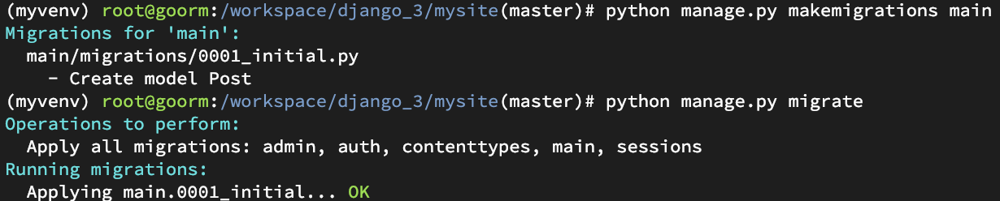  

#### `Admin`에 권한
##### `mysite/main/admin.py`
```python
from django.contrib import admin
from .models import Post

admin.site.register(Post)
```
### `Superuser` 만들기
`Superuser`는 게시글 삭제, 수정, 저장하고,  
다른 유저들을 관리합니다.
```console
(myvenv) root@goorm:/workspace/django/mysite# python manage.py createsuperuser
```
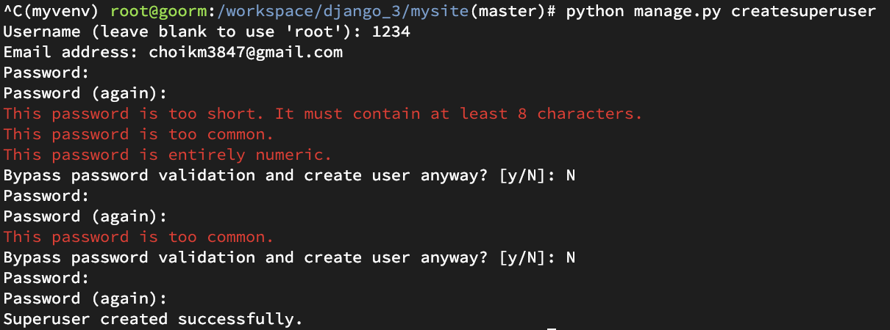  
간단한 비밀번호를 입력하니 똑똑한 장고가 거부합니다  
이제 `Admin User`를 만들었고 [http://0:80/admin](http://0:80/admin)으로 접속합니다  
`Admin User`의 아이디와 비밀번호를 입력해 관리자 페이지로 들어갑니다  
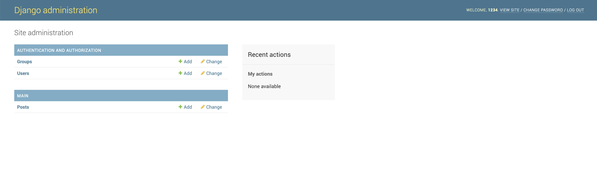  

위의 페이지가 나오면 성공!

이제 게시글을 써봅시다  

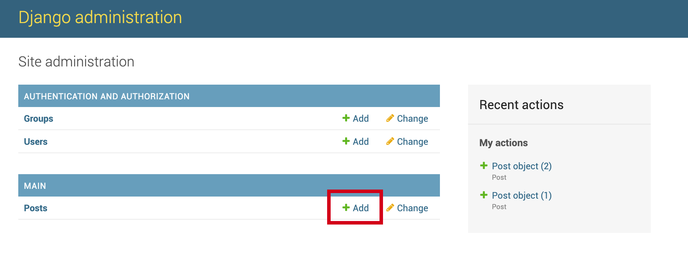  

`Add` 버튼을 눌러 글을 작성하러 갑니다  

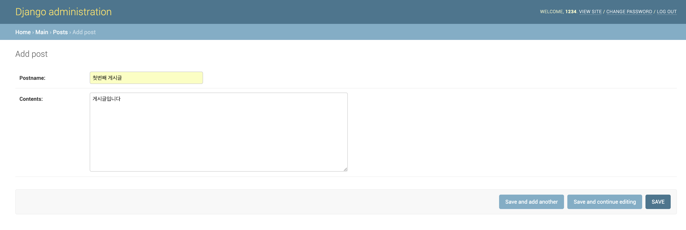    

`postname`과 `contents`를 구분하기 위해 다른 내용으로 작성합시다   

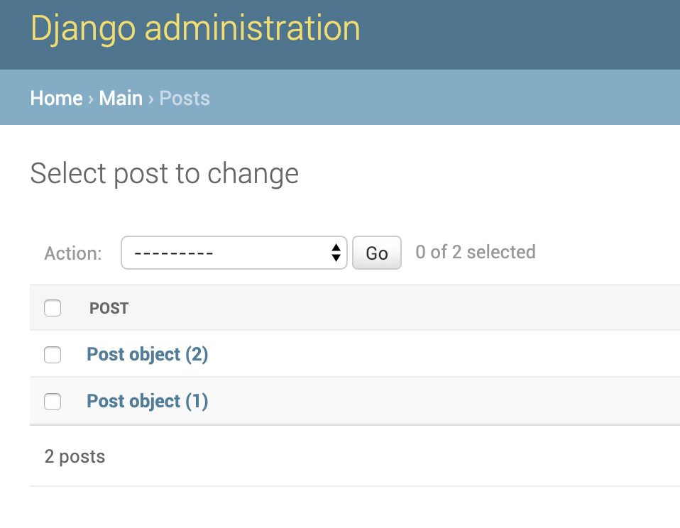  

현재 코드에서 작성은 완료하면 게시글 제목이 나오지 않고 Post object로 나옵니다  
이를 `postname`이 Post object 대신 들어가도록 개선해봅시다  

##### `mysite/main/models.py`

```python
from django.db import models

class Post(models.Model):
    postname = models.CharField(max_length=50)
    contents = models.TextField()
    
    # postname이 Post object 대신 나오기
    def __str__(self):
        return self.postname
```
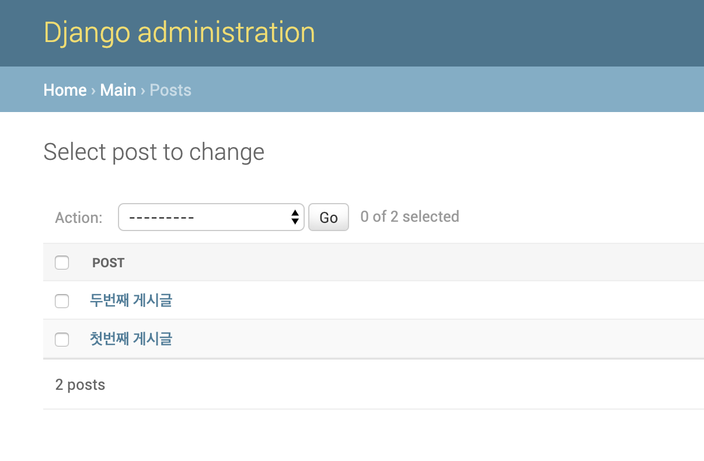

개선완료!

### 목록 페이지에 게시글 띄우기

입력한 게시글을 [http://0:80/blog](http://0:80/blog) 페이지에 띄워봅시다  
`View`가 `post`게시글을 가져오고,  
`Template`에 `post`게시글을 뿌려줍니다


##### 수정 후 `mysite/main/views.py`
`View`가 `post`게시글을 가져옵니다
```python
from django.shortcuts import render
# 모델에 Post 가져오기
from .models import Post

# Create your views here.
def index(request):
    return render(request, 'main/index.html')

# blog에 Post를 전부 가져오자
def blog(request):
    postlist = Post.objects.all()
    return render(request, 'main/blog.html', {'postlist':postlist})
```
##### 수정 후 `mysite/main/templates/main/blog.html`
`Template`에 `post`게시글을 뿌려줍니다
```html
<html>
<head>
    <title>Django Tutorial!</title>
</head>
<body>
    <h1>Blog Page!</h1>
    <table>
    
    <tr>
        <td>{{list.postname}}</td>
        <td>{{list.contents}}</td>
    </tr>
    
    </table>
</body>
</html>
```
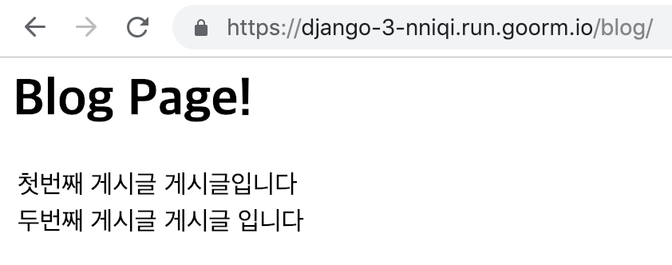  

기본적인 게시판을 만들었습니다  
`django` 별거 없죠?

## 게시글 세부페이지
게시글마다 `postdetails`세부페이지를 만들어봅니다  

##### `/mysite/tutorialdjango/urls.py`
첫번째 게시글 세부페이지 들어가기 - [http://0:80/blog/1](http://0:80/blog/1)  

```python
from django.contrib import admin
from django.urls import path
# index, blog, postdetails 페이지 추가
from main.views import index, blog, postdetails

urlpatterns = [
    path('admin/', admin.site.urls),
    # url로 접속 후 첫 화면은 index.html
    path('', index),
    # localhost:80/blog 접속하면 blog 페이지
    path('blog/', blog),
    # localhost:80/blog/게시글넘버 게시글 세부페이지
    path('blog/<int:pk>/', postdetails),
]
```
##### `/mysite/main/views.py`
`postlist` 세부페이지에 가져올 내용을 정합니다  
특정 `post` 1개만 가져옵니다  
```python
from django.shortcuts import render
# 모델에 Post 가져오기
from .models import Post

# Create your views here.
def index(request):
    return render(request, 'main/index.html')

# blog에 Post를 전부 가져오자
def blog(request):
    postlist = Post.objects.all()
    return render(request, 'main/blog.html', {'postlist':postlist})

# 게시글별 세부페이지
def postdetails(request, pk):
    postlist = Post.objects.get(pk=pk)
    return render(request, 'main/postdetails.html', {'postlist':postlist})
```
##### `mysite/main/templates/main/postdetails.html`
```html
<html>
<head>
    <title>Django Tutorials!</title>
</head>
<body>
    <h1>Postdetails Page!</h1>
    <p>{{postlist.postname}}</p>
    <p>{{postlist.contents}}</p>
</body>
</html>
```
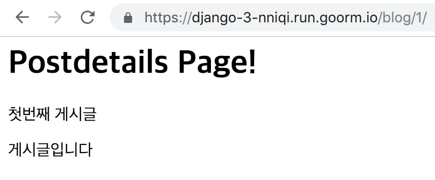  

게시글 세부페이지 완성!

### `blog` 페이지에서 `postdetails` 페이지 링크
`blog` 게시글 목록에서 클릭하면 `postdetails` 세부페이지로 갈 수 있게 합니다
##### `mysite/main/templates/main/blog.html`
`<tr>`태그에 onclick 요소를 넣어 클릭시 넘어가게 합시다  
`http://0:80`url은 자신의 url에 맞춰 수정합니다

```html
<html>
<head>
    <title>Django Tutorial!</title>
</head>
<body>
    <h1>Blog Page!</h1>
    <table>
    
    <tr onclick="location.href='http://0:80/blog/{{ list.pk }}/'">
        <td>{{list.postname}}</td>
        <td>{{list.contents}}</td>
    </tr>
    
    </table>
</body>
</html>
```
### `postdetails` 페이지에서 `blog`페이지로 링크

##### `mysite/main/templates/main/postdetails.html`
`<a href="http://0:80/blog/">목록</a>`를 추가합니다  
`http://0:80`url은 자신의 url에 맞춰 수정합니다
```html
<html>
<head>
    <title>Django Tutorials!</title>
</head>
<body>
    <h1>Postdetails Page!</h1>
    <p>{{postlist.postname}}</p>
    <p>{{postlist.contents}}</p>
    <a href="http://0:80/blog/">목록</a>
</body>
</html>
```
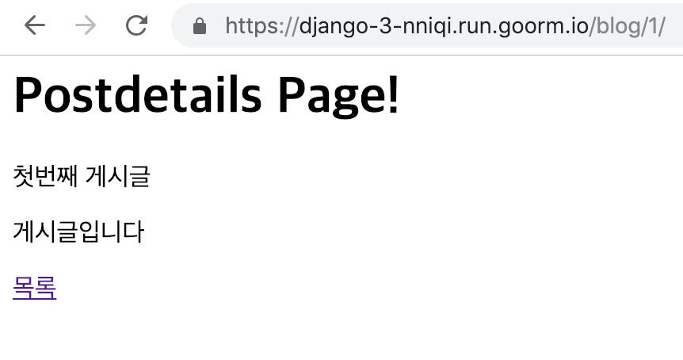

`blog`로 가는 링크 추가!

## 이미지 업로드
사진이 들어갈 부분을 추가합니다  
게시글 모델에 사진이 들어갈 변수를 정하고,  
기존의 게시글엔 사진값에 `NULL`값을 넣습니다.  

`mainphoto = models.ImageField(blank=True, null=True)`  
파이썬 코드로 어렵지 않죠?

##### `mysite/main/models.py`
```python
from django.db import models

class Post(models.Model):
    postname = models.CharField(max_length=50)
    # 게시글 Post에 이미지 추가
    mainphoto = models.ImageField(blank=True, null=True)
    contents = models.TextField()
    
    # postname이 Post object 대신 나오기
    def __str__(self):
        return self.postname
```

모델을 수정한 후 사진을 처리할 수 있는 라이브러리를 설치해야 합니다.  
`Pillow`를 사용하며 아래와 같이 설치할 수 있습니다.  

```console
(myvenv) root@goorm:/workspace/django/mysite# pip install pillow==2.9.0
```
```console
(myvenv) root@goorm:/workspace/django/mysite# python manage.py makemigrations
```
```console
(myvenv) root@goorm:/workspace/django/mysite# python manage.py migrate
```
```console
(myvenv) root@goorm:/workspace/django/mysite# python manage.py runserver 0:80
```
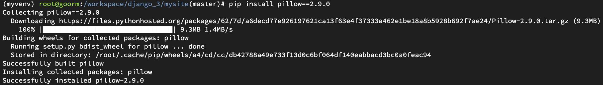  
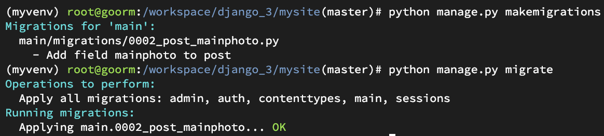  
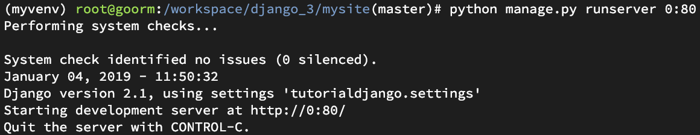  

`pillow` 라이브러리 설치 완료

##### change post
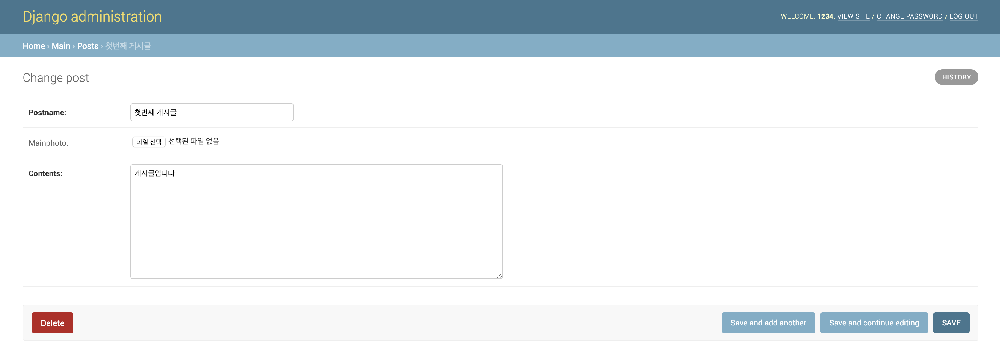
##### add post
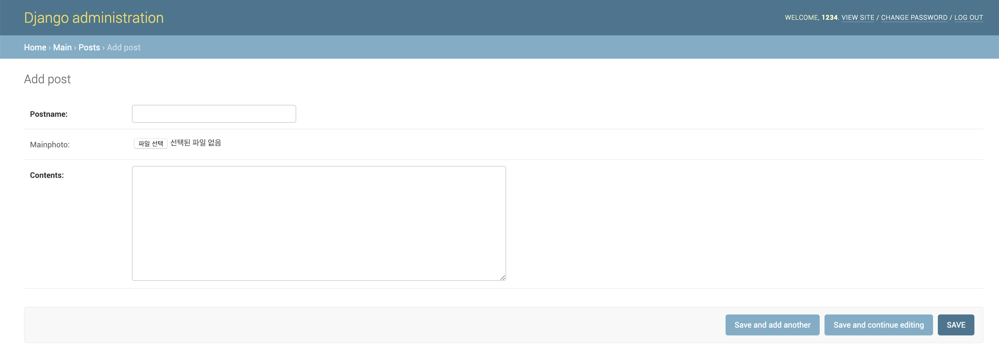

#### 사진이 저장될 공간 설정
##### `mysite/tutorialdjango/settings.py`
`setting.py`파일 제일 아래에 추가합니다
```python
126 MEDIA_ROOT = os.path.join(BASE_DIR, 'media')
127 MEDIA_URL = '/media/'
```

파일이 저장되는 공간을 추가했지만 아직 `django`가 파일 경로를 찾지 못합니다  
이를 확인해봅니다

게시글 세부페이지에서 확인합니다  
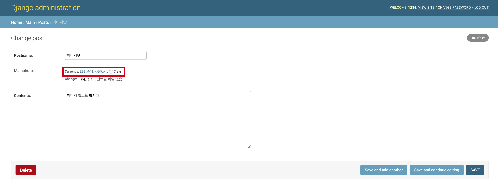   

이렇게 에러가 납니다  
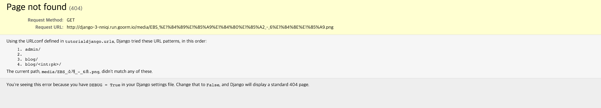  

이미지의 경로를 설정해 가져옵시다

##### `mysite/tutorialdjango/urls.py`

```python
from django.contrib import admin
from django.urls import path
# index, blog, postdetails 페이지 추가
from main.views import index, blog, postdetails
# 사진을 static으로 생각하고 settings에 설정한 경로를 가져옵니다
from django.conf.urls.static import static
from django.conf import settings

urlpatterns = [
    path('admin/', admin.site.urls),
    # url로 접속 후 첫 화면은 index.html
    path('', index),
    # localhost:80/blog 접속하면 blog 페이지
    path('blog/', blog),
    # localhost:80/blog/게시글넘버 게시글 세부페이지
    path('blog/<int:pk>/', postdetails),
]

# 이미지 url 설정
urlpatterns += static(settings.MEDIA_URL, document_root=settings.MEDIA_ROOT)
```

이제 업로드한 사진이 뜹니다  
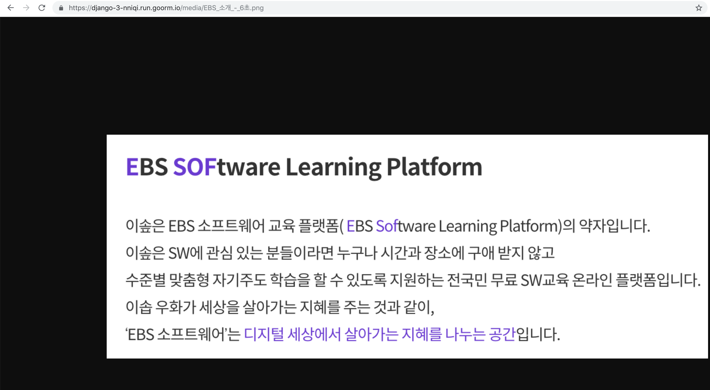

##### `mysite/main/templates/main/postdetails.html`
게시글마다 이미지를 보여줍니다
```html
<html>
<head>
    <title>Django Tutorials!</title>
</head>
<body>
    <h1>Postdetails Page!</h1>
    <p>{{postlist.postname}}</p>
    <p>{{postlist.contents|linebreaks}}</p>
    <!-- 이미지 보여주기 -->
    
        
    
    <!--https://django-3-nniqi.run.goorm.io 를 자신의 url로 수정하기 -->
    <a href="https://django-3-nniqi.run.goorm.io/blog/">목록</a>
</body>
</html>
```
이미지가 뜬 걸 확인합니다  
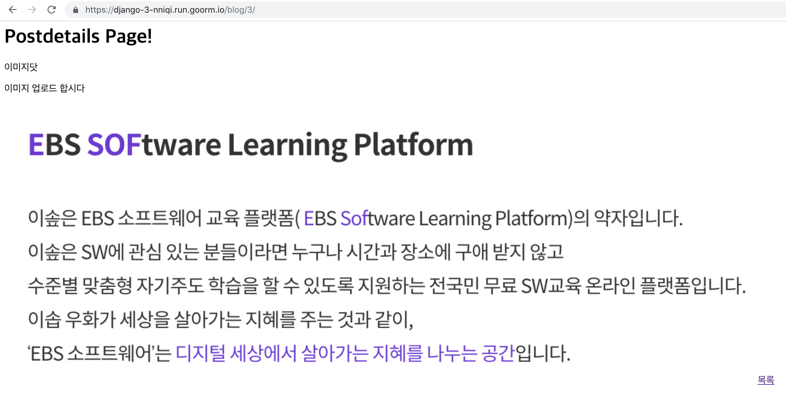   

고생 많으셨습니다
